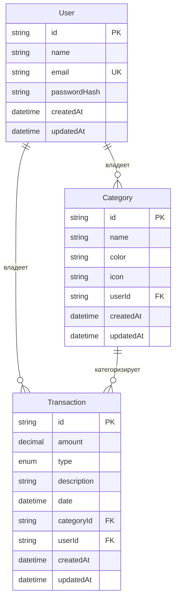

# База данных

PostgreSQL 17 (Docker, порт 5432), схема — `packages/db/prisma/schema.prisma`, Prisma 7 без
Rust-движка (обязателен driver adapter `@prisma/adapter-pg`, см. `packages/db/src/index.ts`).
URL подключения задаётся в `packages/db/prisma.config.ts`, не в `schema.prisma`.

Все id — `uuid(7)` (UUID v7, монотонно возрастающий по времени — удобен для сортировки и
пагинации по вставке).

## ER-диаграмма



## User

Учётная запись.

| Поле           | Тип        | Назначение                                                        |
| -------------- | ---------- | -------------------------------------------------------------------- |
| `id`           | `String`   | PK, `uuid(7)`                                                        |
| `name`         | `String`   | Отображаемое имя                                                    |
| `email`        | `String`   | Логин, `@unique`. Нормализуется (`normalizeEmail`) перед сравнением и записью в `users`-хендлерах |
| `passwordHash` | `String`   | bcrypt-хэш (10 раундов), наружу никогда не отдаётся — см. `UserReadModel` vs `UserCredentials` |
| `createdAt`    | `DateTime` | `@default(now())`                                                    |
| `updatedAt`    | `DateTime` | `@updatedAt`                                                         |

Связи: `categories: Category[]`, `transactions: Transaction[]`.

## Category

Категория трат, принадлежит ровно одному пользователю.

| Поле        | Тип        | Назначение                                                                 |
| ----------- | ---------- | ---------------------------------------------------------------------------- |
| `id`        | `String`   | PK, `uuid(7)`                                                                |
| `name`      | `String`   | Название категории                                                          |
| `color`     | `String`   | HEX-цвет `#rrggbb` (валидируется на уровне API-DTO, не БД)                   |
| `icon`      | `String`   | Имя иконки lucide в kebab-case, например `shopping-cart`                    |
| `userId`    | `String`   | FK → `User.id`, `onDelete: Cascade` — удалили пользователя, удалились и его категории |
| `createdAt` | `DateTime` | `@default(now())`                                                            |
| `updatedAt` | `DateTime` | `@updatedAt`                                                                  |

Связь: `transactions: Transaction[]`.

**`@@unique([userId, name])`** — имя категории уникально в пределах пользователя, разные
пользователи могут завести одноимённые категории. Этот же составной индекс (`userId` —
ведущая колонка) покрывает и выборку «все категории пользователя» — отдельный `@@index` не
нужен.

## TransactionType (enum)

```
income | expense
```

## Transaction

Доход или расход пользователя, всегда привязан к категории.

| Поле          | Тип               | Назначение                                                              |
| ------------- | ------------------ | -------------------------------------------------------------------------- |
| `id`          | `String`           | PK, `uuid(7)`                                                              |
| `amount`      | `Decimal(12, 2)`   | Всегда положительная сумма; знак операции определяется полем `type`, не самим числом |
| `type`        | `TransactionType`  | `income` \| `expense`                                                     |
| `description` | `String`           | Свободный текст                                                           |
| `date`        | `DateTime`         | Дата операции — не путать с `createdAt` (временем внесения записи в систему) |
| `categoryId`  | `String`           | FK → `Category.id`, **`onDelete: Restrict`**                              |
| `userId`      | `String`           | FK → `User.id`, `onDelete: Cascade`                                       |
| `createdAt`   | `DateTime`         | `@default(now())`                                                          |
| `updatedAt`   | `DateTime`         | `@updatedAt`                                                                |

**`categoryId` — `onDelete: Restrict`, а не `Cascade`.** Удаление категории не должно уносить
историю трат: пока у категории есть транзакции, удалить её нельзя. На уровне API это
превращается в `409 Conflict` (Prisma отдаёт `P2003`, `CategoriesService.remove` перехватывает
его отдельно от общего маппинга ошибок).

**`@@index([userId, date])`** — покрывает и выборку всех транзакций пользователя (`userId` —
ведущая колонка), и фильтр по периоду (`date` в диапазоне) одним и тем же индексом.

`amount` в БД — тип `Decimal`, наружу API всегда отдаёт обычное число
(`amount.toNumber()` в `TransactionsRepository.toRecord`) — точность денег в хранении,
удобство в JSON.

## Миграции

`packages/db/prisma/migrations/`:

1. `20260805185032_init_user` — модель `User`.
2. `20260808193224_add_category` — модель `Category` + связь с `User`.
3. `20260815180515_add_transaction` — enum `TransactionType` + модель `Transaction`.

Порядок отражает порядок появления сущностей в проекте: `User` → `Category` → `Transaction`.

## Сид (`packages/db/prisma/seed.ts`)

`npm run db:seed` (`tsx prisma/seed.ts`, без Prisma CLI — грузит корневой `.env` сам через
`dotenv`, `prisma.config.ts` в этом пути не участвует).

Приводит один аккаунт `demo@example.com` к фиксированному состоянию, а не дополняет его:
имя/пароль перезаписываются (`upsert` с непустым `update`), лишние категории и все операции
удаляются перед вставкой заново — идемпотентно, повторный запуск не удваивает данные. Порядок
удаления обязателен: сначала `transaction.deleteMany`, потом `category.deleteMany` — иначе
`onDelete: Restrict` не даст тронуть категорию с операциями. Чужих данных сид не касается —
всё привязано к `demo@example.com`.

Итоговое состояние: пользователь `demo@example.com` / пароль `demo-password`, пять категорий
(«Продукты», «Транспорт», «Жильё», «Развлечения», «Зарплата»), тринадцать операций за два
месяца (июль и август 2026) — специально больше одного месяца, чтобы было на чём проверить
фильтр по периоду.
